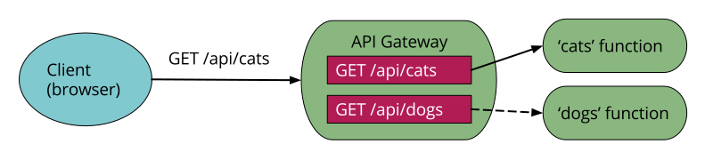

@title[Intro]

## R API on Serverless  

_DC Web API Meetup_  
_10/02/2018_   

_Andrew Conklin_

---
@title[Audience]

## The Audience
Contributors to Production Data Science 

<ol>
<li>Solution & Analytics Architects</li>
<li>Data Scientists & Engineers</li>
<li>Execs/Managers</li>
</ol>

---
@title[Agenda]

## The Agenda

<ol>
<li>What is Serverless?</li>
<li>Cloud Providers</li>
<li>Cloud Interactions</li>
<li>Builder Steps</li>
<li>Iterating Faster</li>
</ol>

---?image=img/serverless.jpg&opacity=20

@title[Are you Serverless?]

@snap[south text-white]

Are you Serverless?

@snapend

+++
@title[What is Serverless?]

## What is Serverless?

Functions-as-a-Service: Develop applications without administrating infrastructure.  

+++
@title[Why use Serverless?]

## Why use Serverless?

So developers can focus more time on core product with scale performance instead of servers and runtimes.  

+++
@title[Limitations]

## Limitations / Benefits

@ol
- Stateless
- 1000+ simultaneous function calls
- 4-9 minutes of execution time per call
- 1.5GB - 3.0 GB of Memory per function call
@olend

+++
@title[Example?]

## How about an Example?

@snap[west span-50]

@snapend

@ol
- Stateless
- 1000+ simultaneous function calls
- 4-9 minutes of execution time per call
- 1.5GB - 3.0 GB of Memory per function call
@olend
