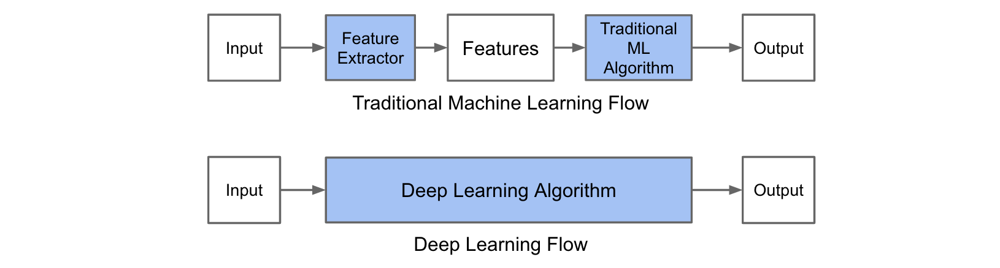

@title[Intro]

## R API on Serverless  

_DC Web API Meetup_  
_10/02/2018_   

_Andrew Conklin_

---
@title[Audience]

## The Audience
Contributors to Production Data Science 

<ol>
<li>Solution & Analytics Architects</li>
<li>Data Scientists & Engineers</li>
<li>Execs/Managers</li>
</ol>

---
@title[Agenda]

## The Agenda

<ol>
<li>What is Serverless?</li>
<li>How do I get started?</li>
<li>Where does R fit?</li>
<li>Whats next?</li>
</ol>

---
@title[Agenda]

## First! Two basics.

+++
@title[function call]

## What is a Function Call?

@snap[span-100]

@snapend

+++
@title[R Model]

## What is an R Model?

A file object that is generated by a learning algorithm with training data. 

It accepts input values and provides output values, like a function.

@snap[span-100]

@snapend

---?image=img/serverless.jpg

@title[Are you Serverless?]

@snap[south text-white]

Are you Serverless?

@snapend

+++
@title[What is Serverless?]

## What

Functions-as-a-Service: Develop applications without administrating infrastructure  

+++
@title[Why use Serverless?]

## Why

More time on core product, less time on servers and runtimes

+++
@title[Constraints]

## Constraints / Benefits

@ol
- Stateless function call
- 4-9 minutes of execution time per call
- 1.5GB - 3.0 GB of Memory per call
- 1000+ simultaneous calls
@olend

+++
@title[Supported Languages]

## Supported Languages

Node.js, Python, Go, Java, C#, F#, PowerShell, Swift
  
...what about R?

---?image=img/start.jpg

@title[Where do I start?]

@snap[south text-white]

Where do I start?

@snapend

---
@title[Interfaces]

## Interfaces

Command Line Interfaces, Software Development Kits, Serverless.com Framework
  
...what about R?

---?image=img/lemons.jpg
@title[Time to make Lemonade]

@snap[south text-white]

Time to make Lemonade

@snapend

---
@title[Starting from scratch with AWS]

## Starting from scratch with AWS
@ol
- Create AWS architecture
- Build Lambda Package
- Deploy and Test Package
@olend

---
@title[AWS Architecture]

## AWS architecture

new API Gateway, new Lambda instance, and new S3 bucket for R models

---
@title[Build Lambda Package]

## Build Lambda Package

@ol
- Create an AWS Virtual Machine
- Add Python, Fortran, R Project, R Packages
- Create Python Virtual Environment with r2py
- Copy a bunch of low level files into venv
- Write Python handler to interact with R through r2py
- Zip it up and store on S3!
@olend

---
@title[Deploy and Test]

## Deploy and Test

@snap[span-100]

@snapend

---
@title[Deploy and Test]

## Deploy and Test

This is really boring and there should be an open source package for this.  (*hint!)

---
@title[Get in Touch]

@snap[span-100]

@snapend

Andrew Conklin 
https://linkedin.com/in/adconk 
https://github.com/adconk
