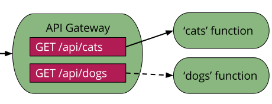

@title[Intro]

## R API on Serverless  

_DC Web API Meetup_  
_10/02/2018_   

_Andrew Conklin_

---
@title[Audience]

## The Audience
Contributors to Production Data Science 

<ol>
<li>Solution & Analytics Architects</li>
<li>Data Scientists & Engineers</li>
<li>Execs/Managers</li>
</ol>

---
@title[Agenda]

## The Agenda

<ol>
<li>What is Serverless?</li>
<li>How do I get started?</li>
<li>Where does R fit?</li>
<li>Whats next?</li>
</ol>

---?image=img/serverless.jpg

@title[Are you Serverless?]

@snap[south text-white]

Are you Serverless?

@snapend

+++
@title[What is Serverless?]

## What

Functions-as-a-Service: Develop applications without administrating infrastructure  

+++
@title[Why use Serverless?]

## Why

More time on core product, less time on servers and runtimes

+++
@title[Constraints]

## Constraints / Benefits

@ol
- Stateless function call
- 4-9 minutes of execution time per call
- 1.5GB - 3.0 GB of Memory per call
- 1000+ simultaneous calls
@olend

+++
@title[function call]

## What is a Function Call?

@snap[span-100]

@snapend

+++
@title[Supported Languages]

## Supported Languages

Node.js, Python, Go, Java, C#, F#, PowerShell, Swift
  
...what about R?

---?image=img/start.jpg

@title[Where do I start?]

@snap[south text-white]

Where do I start?

@snapend

---
@title[Interfaces]

## Interfaces

Command Line Interfaces, Software Development Kits, Serverless.com Framework
  
...what about R, again?

---
@title[Time to make Lemonade]

---?image=img/lemons.jpg
@title[Time to make Lemonade]

@snap[south text-white]

Time to make Lemonade

@snapend

---
@title[An AWS example]

##
@ol
- Pick a cloud (AWS)
- Create an API Gateway
- Create a Lambda Function
- Create an EC2 instance
- Build a Lambda Package
- Deploy Package to Lambda
@olend
